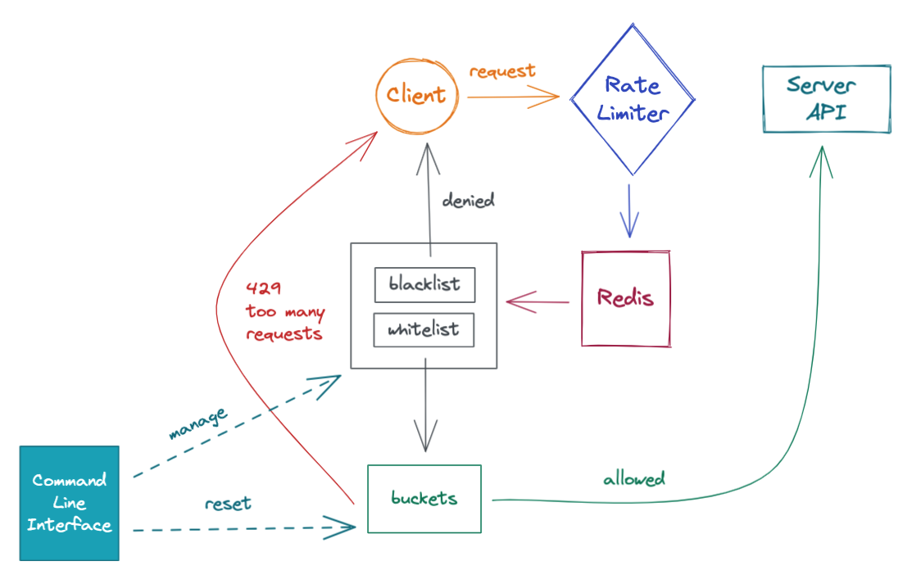

# Brute Force Protection Service

## Description

- The main purpose of the service - ensure protection from Brute Force attacks during authorization.

## Algorithm

The service limits frequency of attempts for different sets of parameters e.g.:
- No more than N (e.g. 10) attempts per minute for current login
- No more than M (e.g. 100) attempts per minute for current password
- No more than K (e.g. 1000 - cause NAT) attempts per minute for current IP

For rate limiting algorithms the service uses:
- [Token Bucket](https://en.wikipedia.org/wiki/Token_bucket):
  - 1 global bucket for password
  - 1 bucket for each login
  - 1 bucket for each ip
  - refill rate: 1 minute *

- There are blacklist and whitelist, which provide exceptions for certain IP addresses *

****adjustment available via CLI***

## Architecture

//todo: add pictures from Figma
gRPC API <---> database

## Command Line Interface

Commands:
- reset bucket for IP
- edit black/white lists

## Deploy
make run
docker compose up

## Tests

- handling bucket and do unit-tests
- integrational testings (API's)
